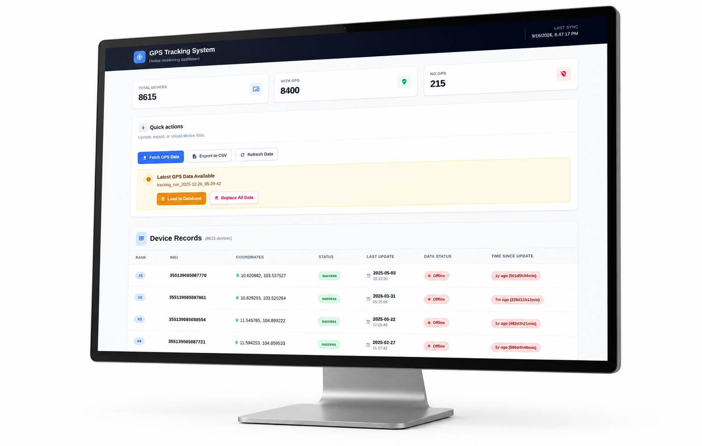
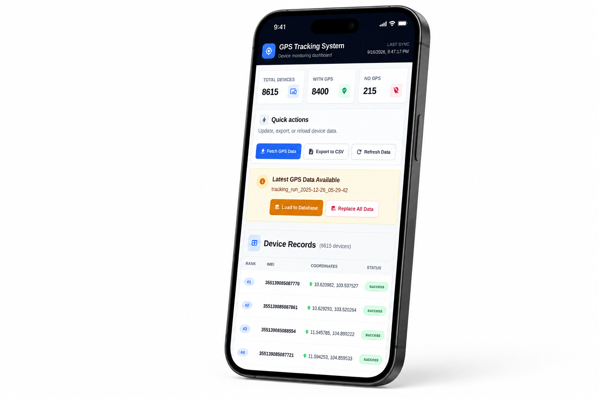
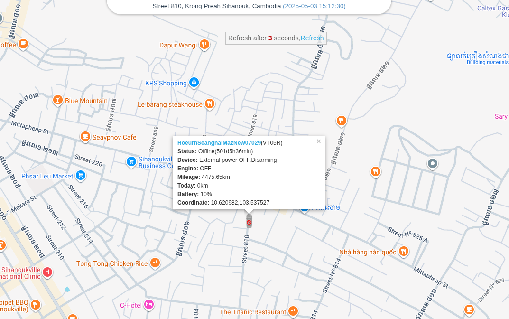

# GPS Tracking System

A full-stack dashboard for collecting, organizing, and reviewing GPS device data from ProTrack365. It gives operations teams one place to monitor a fleet, assess GPS availability and device status, refresh tracking data, and export records for further analysis.

Built as a production-focused portfolio project, with an emphasis on a clear operational workflow, responsive UI, and an API-backed data pipeline.



## What it does

- Retrieves GPS tracking records for a configured list of device IMEIs through the ProTrack365 API.
- Processes and stores device coordinates, connectivity state, last-heartbeat information, and import status in Django.
- Presents paginated device records with dashboard totals for all devices, devices with GPS, and devices without GPS.
- Runs collection and import work in the background so the dashboard remains responsive while it polls for completion.
- Exports the current device dataset as a timestamped CSV file.
- Works across desktop and mobile screen sizes.

## Screenshots

### Operations dashboard

The dashboard combines fleet totals, data-refresh controls, a recent-data indicator, and a device table. Each device record includes its IMEI, coordinates, status, last update, and data-status label.


### Mobile experience

The same operational controls and summary metrics adapt to a narrow screen.

<p align="center">
  
</p>

### IMEI verification in ProTrack365

For device-level follow-up, an organizer can use the device ID / IMEI in the ProTrack365 application to locate the device on its map and inspect its current information. This screenshot shows the matching location view in ProTrack365.



## How the workflow fits together

```text
Configured IMEI list
        |
        v
ProTrack365 API --> fetch & process GPS records --> Django database
                                                     |
                                                     v
                                      Nuxt dashboard / CSV export
                                                     |
                                                     v
                               IMEI follow-up in ProTrack365 map
```

1. Add the device IMEIs to the configured CSV source.
2. An organizer selects **Fetch GPS Data** in the dashboard; the backend requests the latest data from ProTrack365.
3. When collection finishes, choose **Load to Database** to add records, or **Replace All Data** to refresh the dataset completely.
4. Review fleet health and device records in the dashboard, or export them to CSV.
5. When a specific device needs attention, use its ID / IMEI in ProTrack365 to see its location and detailed status on the map.

## Tech stack

| Layer | Technology |
| --- | --- |
| Frontend | Nuxt 3, Vue 3, Tailwind CSS |
| Backend | Django 4.2+, Python |
| Data access | Django ORM; SQLite locally, PostgreSQL-compatible via `DATABASE_URL` |
| External integration | ProTrack365 API using `requests` and `aiohttp` |
| Production utilities | Gunicorn, WhiteNoise, CORS support |

## Project structure

```text
.
├── backend/
│   ├── api/                         # API endpoints, models, services, commands
│   ├── scripts/MAIN.csv             # Source IMEI list
│   ├── response_logs/               # Timestamped fetch results (JSON and CSV)
│   ├── protrack/                    # Django settings and routes
│   └── manage.py
├── frontend/nuxt-app/               # Nuxt single-page dashboard
├── docs/images/                     # README screenshots
└── README_DEPLOY.md                 # Deployment notes
```

## Run locally

### Prerequisites

- Python 3.10+
- Node.js 18+
- A ProTrack365 account with API access

### 1. Start the backend

```bash
cd backend
python -m venv .venv
source .venv/bin/activate
pip install -r requirements.txt
cp .env.example .env
python manage.py migrate
python manage.py runserver
```

Update `backend/.env` with your own ProTrack365 credentials:

```dotenv
DEBUG=true
SECRET_KEY=use-a-long-random-value
PROTRACK_ACCOUNT=your-account
PROTRACK_PASSWORD=your-password
```

The API is then available at `http://127.0.0.1:8000/api/`.

### 2. Start the frontend

In a second terminal:

```bash
cd frontend/nuxt-app
npm install
npm run dev
```

Open `http://localhost:3000`. By default, the frontend connects to `http://127.0.0.1:8000/api`.

To point it at another backend, set `NUXT_PUBLIC_API_BASE` before starting or building the app:

```bash
NUXT_PUBLIC_API_BASE=https://your-api.example.com/api npm run dev
```

## Main API endpoints

| Endpoint | Purpose |
| --- | --- |
| `GET /api/stats/` | Dashboard summary totals |
| `GET /api/devices/?page=1&per_page=50` | Paginated device records |
| `POST /api/fetch-tracking/` | Start a ProTrack365 data-collection job |
| `GET /api/tracking-status/` | Check the collection job |
| `POST /api/load-database/` | Import a collected JSON file into the database |
| `GET /api/import-status/` | Check the import job |
| `GET /api/export-csv/` | Download device data as CSV |
| `GET /healthz/` | Lightweight application health check |

## Production notes

- Keep `PROTRACK_ACCOUNT`, `PROTRACK_PASSWORD`, and `SECRET_KEY` only in environment variables—never commit them.
- Set `DEBUG=false`, `ALLOWED_HOSTS`, and `CORS_ALLOWED_ORIGINS` for the deployed domains.
- Set `DATABASE_URL` to use a managed PostgreSQL database in production.
- See [README_DEPLOY.md](README_DEPLOY.md) for the existing deployment outline.

## Important notice

This application is intended for authorized fleet and asset tracking only. Handle IMEI numbers, account credentials, location data, and exported reports as sensitive operational data.
